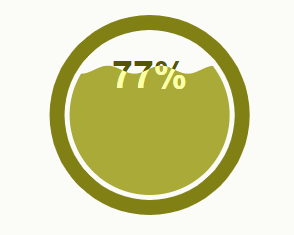
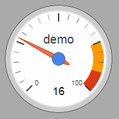

# d3.js0_to_1

>## [學習d3.js](https://www.oxxostudio.tw/articles/201410/svg-d3-js.html)
>>#### day 01 [你好D3](https://www.oxxostudio.tw/articles/201410/svg-d3-info.html)
>>#### day 02 [淺談 D3.js 的資料處理](https://www.oxxostudio.tw/articles/201411/svg-d3-01-data.html)
>>#### day 03 [繪製線段](https://www.oxxostudio.tw/articles/201411/svg-d3-02-line.html)
>>#### day 04 [定義比例 ( scale.linear() )](https://www.oxxostudio.tw/articles/201411/svg-d3-03-scale-linear.html)
>>#### day 05 [座標軸 ( Axis )](https://www.oxxostudio.tw/articles/201411/svg-d3-04-axis.html)
>>#### day 06 [區域 ( area )](https://www.oxxostudio.tw/articles/201411/svg-d3-05-area.html)
>>>day06-demo 為整體整合後用法
>>#### day 07 [巢狀數據結構 ( d3.nest )](https://www.oxxostudio.tw/articles/201412/svg-d3-06-data-nest.html)
>>#### day 08 [陣列數據地圖 ( d3.map )](https://www.oxxostudio.tw/articles/201412/svg-d3-07-data-map.html)
>>#### day 09 [序數比例尺 ( ordinal )](https://www.oxxostudio.tw/articles/201412/svg-d3-08-ordinal.html)
>>>day09-demo 為整體整合後用法
>>#### day 10 [定義色彩 - 基本篇 ( colors )](https://www.oxxostudio.tw/articles/201412/svg-d3-09-colors-1.html)
>>#### day 11 [定義色彩 - 應用篇 ( colors )](https://www.oxxostudio.tw/articles/201412/svg-d3-10-colors-2.html)
>>#### day 12 [時間格式 ( Time Formatting )](https://www.oxxostudio.tw/articles/201412/svg-d3-11-time.html)
>>#### day 13 [數字格式 ( Formatting )](https://www.oxxostudio.tw/articles/201501/svg-d3-12-formatting.html)
>>#### day 14 [CSV 數據處理](https://www.oxxostudio.tw/articles/201501/svg-d3-13-csv.html)
>>#### day 15 [transition 基本篇](https://www.oxxostudio.tw/articles/201501/svg-d3-14-transition-1.html)
>>#### day 16 [transition ( tween、interpolate )](https://www.oxxostudio.tw/articles/201509/svg-d3-15-transition-tween.html)
>>#### day 17 [拖拉行為 ( Drag Behavior )](https://www.oxxostudio.tw/articles/201509/svg-d3-16-drag-behavior.html)
>>#### day 18 [縮放行為 ( Zoom Behavior )](https://www.oxxostudio.tw/articles/201509/svg-d3-17-zoom-behavior.html)
>>#### day 19 [D3.js - Enter、Update 和 Exit](https://www.oxxostudio.tw/articles/201509/svg-d3-18-enter-update-exit.html)
>>>這個蠻重要的記得到時候往前提
    Demo拿到範例資料後自己練習看看，最後再看範例程式碼

官方學習指南
https://github.com/d3/d3/wiki/Tutorials

## [官方Demo表](https://github.com/d3/d3/wiki/Gallery)
---
### 下方自我練習用
---
#### [D3LiquidFillGauge](http://bl.ocks.org/brattonc/5e5ce9beee483220e2f6)

一個圓形水波特效的顯示效果

>對"displayPercent"進行了更改，不設定就是%其他的看設定
>對"updata"事件進行修改，讓他可以吃'config'設定,[參考](https://jsfiddle.net/15h0fxn7/)

---
#### [google gauges using d3.js](http://tomerdoron.blogspot.com/2011/12/google-style-gauges-using-d3js.html)

一個指針型類似儀表版的顯示效果

---